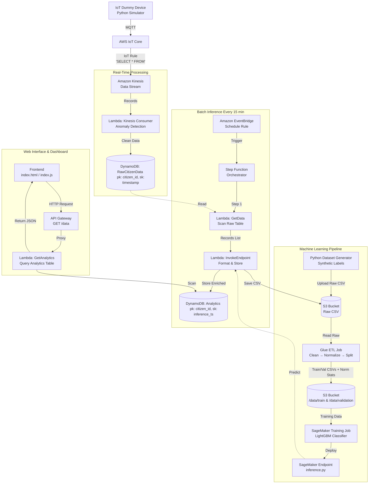

Hetherau: IoT Health Data Analytics

## Background

Hetherau-health-analytics is a cloud-native IoT and data analytics application designed to demonstrate a complete end‑to‑end pipeline for processing Hetherau citizen health data. Dummy IoT devices simulate the collection of vital signs—heart rate, blood oxygen, sleep time, and calories burned—and send them to AWS IoT Core. A real‑time stream processing layer validates the data, discards anomalies, and stores clean records in DynamoDB. A separate machine learning pipeline trains a LightGBM classification model on synthetic labelled data. The trained model is deployed as a SageMaker endpoint, which is invoked every 15 minutes by a Step Function to score all new citizen records. The resulting health classifications are stored in an analytics table and exposed via a simple web interface.

The project is built entirely using Infrastructure as Code (AWS CloudFormation) and serves as a hands‑on exercise for students to learn about AWS services, serverless architectures, and MLOps.

## Architecture Overview



- **Data Ingestion** – Dummy device publishes MQTT messages to AWS IoT Core.
- **Stream Processing** – IoT Rule routes messages to Kinesis; a Lambda consumer filters anomalies and writes valid data to a raw DynamoDB table.
- **ML Pipeline** – Synthetic labelled dataset is generated and stored in S3; a Glue ETL job cleans, normalizes, engineers features, and splits the data into train/validation sets; a SageMaker training job trains a LightGBM classifier and deploys a model endpoint.
- **Batch Inference** – EventBridge triggers a Step Function every 15 minutes. The Step Function reads all raw records, invokes the SageMaker endpoint for predictions, stores the enriched results (with classification) as CSV in S3 and writes them to an analytics DynamoDB table.
- **Web Frontend** – A static HTML page calls an API Gateway endpoint, which triggers a Lambda that queries the analytics table and returns the data to the browser.

## Deployment Specification

Each service in the Hetherau platform has specific deployment requirements.
The table below describes which services **must** be deployed via CloudFormation
and which may be deployed manually (with a point reduction).

| # | Service | Resource Name(s) | Deploy via CloudFormation | Full Pts (CF) | Reduced Pts (Manual) | Notes |
|---|---------|-------------------|--------------------------|---------------|----------------------|-------|
| 1 | **S3 Bucket** | `hetherau-data-bucket` | **Required** | +2 | +1 | Training data & batch results storage |
| 2 | **DynamoDB – RawCitizenData** | `hetherau-RawCitizenData` | **Required** | +2 | +1 | pk: `citizen_id`, sk: `timestamp` |
| 3 | **DynamoDB – Analytics** | `hetherau-Analytics` | **Required** | +2 | +1 | pk: `citizen_id`, sk: `inference_timestamp` |
| 4 | **Kinesis Data Stream** | `hetherau-health-stream` | **Required** | +2 | +1 | Buffers IoT messages for Lambda processing |
| 5 | **Lambda – KinesisConsumer** | `hetherau-kinesis-consumer` | **Required** | +2 | +1 | Real-time anomaly filter |
| 6 | **Lambda – GetData** | `hetherau-get-data` | **Required** | +2 | +1 | Step Function Step 1 |
| 7 | **Lambda – InvokeEndpoint** | `hetherau-invoke-endpoint` | **Required** | +2 | +1 | Step Function Step 2 |
| 8 | **Lambda – GetAnalytics** | `hetherau-get-analytics` | **Required** | +2 | +1 | API Gateway backend |
| 9 | **Step Functions State Machine** | `hetherau-batch-inference` | **Optional** *(no penalty)* | +2 | +2 | Exempt from CF requirement |
| 10 | **EventBridge Rule** | `hetherau-batch-inference-rule` | **Required** | +2 | +1 | Triggers Step Function every 15 min |
| 11 | **API Gateway** | `hetherau-api` | **Required** | +2 | +1 | REST API with `GET /data` endpoint |
| 12 | **IoT Core Policy** | `hetherau-device-policy` | **Required** | +2 | +1 | MQTT connect/publish permissions |
| 13 | **IoT Core Topic Rule** | `hetherau-health-to-kinesis` | **Required** | +2 | +1 | Routes `citizen/health` → Kinesis |
| 14 | **IAM Roles** | `hetherau-*-role` (6 roles) | **Required** | 0 | 0 | Bonus Points for AWS Lab Deployment |
| 15 | **SageMaker Endpoint** | `hetherau-endpoint` | Manual only | +2 (bonus) | +2 (bonus) | Deployed via training script, not CF |

Expected CloudFormation Outputs:

```yaml
  ApiGatewayUrl:
    Description: API Gateway endpoint URL for the analytics dashboard
    Value: !Sub https://${HetherauApiGateway}.execute-api.${AWS::Region}.amazonaws.com/prod/data

  S3BucketName:
    Description: S3 bucket for training data and batch results
    Value: !Ref HetherauS3Bucket

  KinesisStreamName:
    Description: Kinesis data stream name
    Value: !Ref HetherauKinesisStream

  RawDynamoDBTable:
    Description: Raw citizen data DynamoDB table
    Value: !Ref RawCitizenDataTable

  AnalyticsDynamoDBTable:
    Description: Enriched analytics DynamoDB table
    Value: !Ref AnalyticsTable

  IotEndpoint:
    Description: AWS IoT Core endpoint address
    Value: !Sub ${AWS::Region}.amazonaws.com

  StateMachineArn:
    Description: Step Function state machine ARN
    Value: !Ref HetherauStateMachine
```

### Scoring Rules

- **Full points (+2):** Resource exists, uses the `hetherau` naming prefix, AND was deployed via CloudFormation.
- **Reduced points (+1):** Resource exists and uses the correct naming prefix but was deployed **manually** (outside CloudFormation).
- **No points (+0):** Resource is missing entirely.
- **Step Function exemption:** The Step Functions state machine receives full points regardless of deployment method (CloudFormation or manual).
- **SageMaker exemption:** The SageMaker endpoint is deployed via the training script, not CloudFormation. It is graded as bonus points.

### Naming Convention

All resources **must** contain the prefix `hetherau` in their names. The grading script searches for this prefix to identify project resources.

## Prerequisites

- AWS Lab Account
- AWS CLI installed and configured (`aws configure`)
- Python 3.8+ with pip
- Git

## Step‑by‑Step TO‑DO List for Deployment

**Note:** All infrastructure is provisioned via CloudFormation. Follow the steps in the recommended order.

### 1. Clone the Repository

```bash
git clone https://github.com/cydnirn/hetherau-health-analytics.git
cd hetherau-health-analytics
```

### 2. Deploy the Core CloudFormation Stack

The stack creates IoT Core, Kinesis, DynamoDB tables, Lambda functions (except the SageMaker endpoint), Step Function, EventBridge rule, and API Gateway.

```bash
aws cloudformation create-stack \
  --stack-name hetherau-core \
  --template-body file://cloudformation/template.yaml \
  --capabilities CAPABILITY_IAM
```

Wait for the stack to reach `CREATE_COMPLETE` status.

### 3. Generate and Upload Synthetic Training Data

Run the dataset generator to produce labelled training data and upload it to the S3 bucket created by the stack.

```bash
python data_generation/dataset_generator.py
```

This script will automatically detect the bucket name (or you can specify it via environment variable) and upload the CSV file to `s3://<bucket>/data/training/training_data.csv`.

### 4. Run the Glue ETL Job – Data Preparation

Before training the SageMaker model, the raw CSV must be cleaned, normalized, feature-engineered, and split into training and validation sets. This is done by an AWS Glue ETL job.

**What the Glue job does:**

| Step | Description |
|------|-------------|
| Read | Ingests the raw CSV from `s3://<bucket>/data/training/training_data.csv` |
| Audit | Checks for nulls, extreme outliers, and label distribution |
| Clean | Drops `citizen_id` (not a feature), filters heart rate anomalies (<40 or >200), clips out-of-range values, removes duplicates |
| Feature Engineering | Creates `heart_rate_zone`, `o2_risk`, `sleep_quality`, `calorie_efficiency`, `composite_risk_score`, `hr_sleep_interaction` |
| Normalize | Applies StandardScaler to 7 numerical features; saves mean/std stats as JSON for inference-time use |
| Split | Stratified 80/20 train/validation split |
| Write | Outputs SageMaker-compatible CSV (no header, label in first column) and a processed Parquet dataset |

**Option A: Run via AWS Glue Console (recommended for learners)**

1. Upload the Glue script to S3:
   ```bash
   aws s3 cp glue/hetherau_etl.py s3://hetherau-data-bucket/scripts/hetherau_etl.py
   ```

2. Create a Glue Job in the AWS Console:
   - **Name:** `hetherau-etl`
   - **IAM Role:** Select a role with `AWSGlueServiceRole` and S3 read/write permissions
   - **Type:** Spark
   - **Glue version:** Glue 4.0
   - **Script location:** `s3://hetherau-data-bucket/scripts/hetherau_etl.py`
   - **Job parameters:**
     - `--SOURCE_BUCKET`: `hetherau-data-bucket`
     - `--SOURCE_KEY`: `data/training/training_data.csv`
     - `--DEST_BUCKET`: `hetherau-data-bucket`
     - `--GLUE_DATABASE`: `hetherau-catalog` (create in Glue Data Catalog first)
     - `--TEMP_DIR`: `s3://hetherau-data-bucket/temp/`

3. Run the job and wait for `SUCCEEDED` status.

**Option B: Run via AWS CLI**

```bash
# Upload the script
aws s3 cp glue/hetherau_etl.py s3://hetherau-data-bucket/scripts/hetherau_etl.py

# Create the Glue job
aws glue create-job \
  --name hetherau-etl \
  --role <GlueServiceRoleArn> \
  --command "Name=glueetl,ScriptLocation=s3://hetherau-data-bucket/scripts/hetherau_etl.py,PythonVersion=3" \
  --glue-version "4.0" \
  --default-arguments '{
    "--SOURCE_BUCKET":"hetherau-data-bucket",
    "--SOURCE_KEY":"data/training/training_data.csv",
    "--DEST_BUCKET":"hetherau-data-bucket",
    "--GLUE_DATABASE":"hetherau-catalog",
    "--TEMP_DIR":"s3://hetherau-data-bucket/temp/"
  }'

# Start the job run
aws glue start-job-run --job-name hetherau-etl
```

**Output files after successful run:**

```
s3://hetherau-data-bucket/
  data/
    train/
      train.csv                    # SageMaker training CSV (no header, label first)
    validation/
      validation.csv               # SageMaker validation CSV
    processed/                     # Full processed Parquet dataset
    config/
      normalization_stats.json     # Mean/std for inference-time normalization
```

### 5. Train the Model in SageMaker

The training script uses SageMaker's **built-in LightGBM algorithm**. The built-in container handles CSV I/O, training, and inference automatically. You have to run the Glue job first to generate the training/validation CSV files.

```bash
export S3_BUCKET=hetherau-data-bucket
export AWS_ROLE=arn:aws:iam::123456789012:role/LabRole
export AWS_REGION=us-east-1
python sagemaker/training_script.py
```

The script retrieves the LightGBM image, trains with 100 rounds, registers in Model Registry, and deploys to `hetherau-endpoint`.

This script reads the training data from S3, trains a LightGBM model, and deploys it to a SageMaker endpoint. Note the endpoint name; you will need it for the next step.

### 6. Start the Dummy IoT Device

Run the IoT device simulator to start publishing health data.

```bash
python iot/dummy_device.py
```

The device uses the IoT Core endpoint and certificate from the stack outputs. You can pass them as environment variables or update the script to fetch them from SSM Parameter Store.

### 7. Test the End‑to‑End Flow

1. Wait a few minutes for data to accumulate in the raw DynamoDB table.
2. The EventBridge rule fires every 15 minutes. After the first trigger, check the analytics DynamoDB table for new records with classification.
3. Verify that CSV files are being saved in S3 under `/data/hetherau/`.

### 8. Access the Web Frontend

The CloudFormation stack outputs the API Gateway URL and the S3 bucket website URL (if you enable static hosting). Open `index.html` directly in a browser or host it on S3.

You should see a table listing all citizens with their latest health metrics and classification.

## Additional Notes

- **Anomaly Detection** – The Kinesis consumer Lambda currently drops any record where `heart_rate < 40` or `heart_rate > 200` as a placeholder. Adjust the logic as needed.
- **Security** – For production, restrict IAM roles and enable encryption. This demo uses minimal permissions for learning.
- **Cost** – Be aware that SageMaker endpoints incur costs. Shut down the endpoint when not in use.
